# Fence Depot Fence Estimator - Comprehensive Review Document

**Repository:** Auction2026/fence-estimator  
**Branch:** main  
**Document Format:** Markdown (portable to PDF/Word/HTML)

---

## SECTION 1: EXECUTIVE SUMMARY

### Project Overview
Fence Depot Fence Estimator is a full lifecycle estimating and delivery system for fence projects, from first customer intake through sign-off and closeout.

### System Purpose
- Standardize estimating and project planning
- Automate material/labor/cost calculations
- Generate professional customer and internal documents
- Enforce pricing controls and change-order traceability

### Key Features
- 17 functional tabs covering estimate-to-close workflow
- Cross-tab auto-population and calculation engine
- Contract pricing lock
- Permit/locate form generation
- Proposal/contract/sign-off document exports
- Admin configuration and catalog controls

### User Groups
- Estimators
- Sales staff
- Project coordinators
- Install crews
- Admin/management

---

## SECTION 2: SYSTEM ARCHITECTURE OVERVIEW

### 2.1 Complete System Diagram (All 17 Tabs)

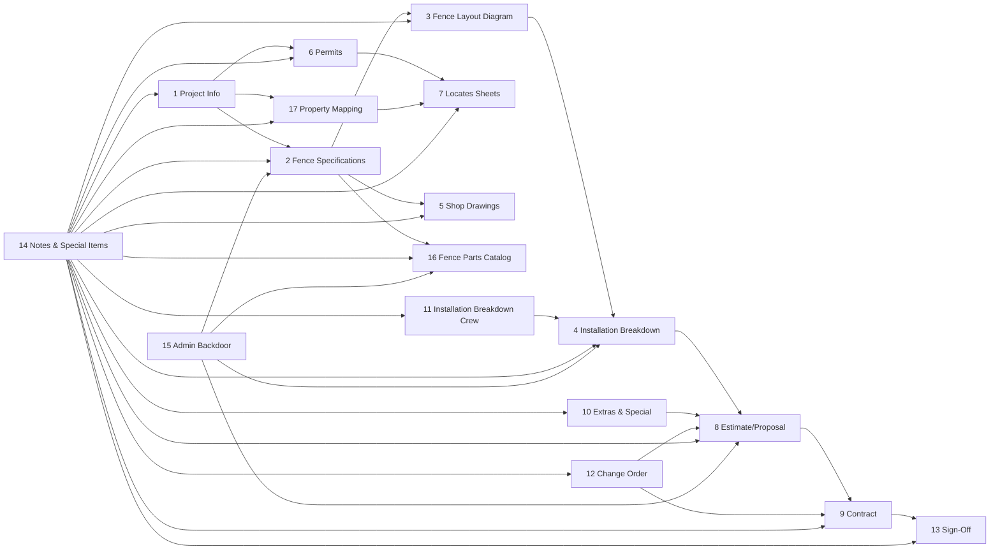

### 2.2 Component Relationships
- **Primary project chain:** T1 -> T2 -> T3 -> T4 -> T8 -> T9 -> T13
- **Compliance branch:** T1 -> T6 -> T7
- **Design branch:** T2 -> T5, T17
- **Control hubs:** T14 (notes hub), T15 (admin/rates hub), T16 (catalog source)

### 2.3 End-to-End Data Flow Summary
1. Customer/project data starts in T1
2. Spec and geometry data defined in T2/T3/T17
3. Material/labor outputs generated in T4/T11 and enriched by T10/T12
4. Commercial outputs generated in T8/T9
5. Closure outputs generated in T13

### 2.4 Navigation Map

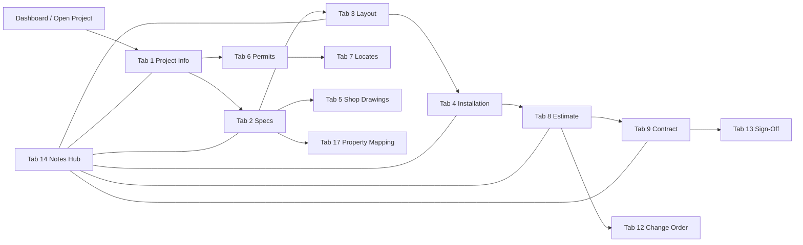

---

## SECTION 3: DETAILED TAB SPECIFICATIONS WITH WIREFRAMES

> Legend used in all wireframes: `[ ]` input, `( )` action, `{ }` computed/read-only

### TAB 1 - Project Info
**Purpose:** Capture core job identity and customer/site details.

```text
+--------------------------------------------------+
| Project Info                                     |
| [Project Name] [Project ID] [Status]             |
| [Customer Name] [Phone] [Email]                  |
| [Site Address] [City] [Postal]                   |
| [Sales Rep] [Target Start] [Target Finish]       |
| (Save Draft) (Continue to Specs)                 |
+--------------------------------------------------+
```

- **Fields:** project metadata, customer contacts, site location, scheduling
- **Data captured:** Project master record
- **Flows next:** Tabs 2, 6, 8, 9, 17
- **Connections:** Permits, mapping, estimate, contract prefill

### TAB 2 - Fence Specifications
**Purpose:** Define fence configuration and rules driving calculations.

```text
+--------------------------------------------------+
| Fence Specifications                             |
| [Fence Type v] [Height v] [Mesh/Gauge v]         |
| [Color v] [Post Type v] [Gate Type v]            |
| [Top/Bottom Rail v] [Privacy Slats v]            |
| [Coating v] [Region Code v]                      |
| (Apply Specs) (Open Layout)                      |
+--------------------------------------------------+
```

- **8+ dropdowns:** type, height, gauge, color, post, gate, rails, slats, coating, region
- **Data captured:** Product/engineering selections
- **Flows next:** Tabs 3, 4, 5, 8, 16
- **Connections:** Drives material rules and pricing logic

### TAB 3 - Fence Layout Diagram
**Purpose:** Draw fence lines and segment attributes.

```text
+--------------------------------------------------+
| Fence Layout Diagram                             |
| Tools: (Line) (Corner) (Gate) (Delete) (Snap)   |
| +----------------------------------------------+ |
| |              Drawing Canvas                  | |
| |  Length labels / segment tags / gate icons   | |
| +----------------------------------------------+ |
| (Validate Layout) (Send to Installation)        |
+--------------------------------------------------+
```

- **Tools:** line draw, edit, gate placement, dimensions, snapping
- **Data captured:** segment lengths, corner counts, gate points
- **Flows next:** Tabs 4, 5, 8
- **Connections:** Converts geometry to bill-of-material inputs

### TAB 4 - Installation Breakdown
**Purpose:** Generate install-ready material and labor calculations.

```text
+--------------------------------------------------+
| Installation Breakdown                           |
| {Total LF} {Posts} {Mesh Rolls} {Concrete}       |
| {Crew Hours} {Equipment} {Waste %}               |
| Material Table | Labor Table | Totals Panel       |
| (Recalculate) (Push to Estimate)                 |
+--------------------------------------------------+
```

- **Calculations:** material quantities, labor hours, equipment usage
- **Data captured:** cost basis and install scope
- **Flows next:** Tabs 8, 11
- **Connections:** estimate costing and crew sheet output

### TAB 5 - Shop Drawings
**Purpose:** Convert design/spec data into fabrication/field drawings.

```text
+--------------------------------------------------+
| Shop Drawings                                    |
| [Drawing Scale] [Sheet Size] [Gate Style]        |
| +----------------------------------------------+ |
| | Auto-generated CAD preview                    | |
| +----------------------------------------------+ |
| (Generate PDF) (Export DXF/PDF)                 |
+--------------------------------------------------+
```

- **Inputs:** scale, format, details, notes
- **Outputs:** drawings/PDF packages
- **Flows next:** Tabs 8, 9, 11
- **Connections:** spec and layout-derived drawing package

### TAB 6 - Permits
**Purpose:** Assemble permit packets based on jurisdiction.

```text
+--------------------------------------------------+
| Permits                                          |
| [Jurisdiction v] [Permit Type v] [Work Class v]  |
| Auto-filled: owner/site/contractor details        |
| Required Docs Checklist [x][x][ ]                |
| (Generate Permit Forms) (Send to Locates)        |
+--------------------------------------------------+
```

- **Fields:** jurisdiction, permit type, required attachments
- **Data captured:** compliance package data
- **Flows next:** Tabs 7, 9
- **Connections:** uses project info + scope details

### TAB 7 - Locates Sheets
**Purpose:** Manage utility locate requirements before digging.

```text
+--------------------------------------------------+
| Locates Sheets                                   |
| Utility Contacts: {Hydro} {Gas} {Telecom}        |
| [Ticket Number] [Requested Date] [Expiry Date]   |
| Safety Checklist [x][x][x][ ]                    |
| (Generate Locate Sheet) (Mark Complete)          |
+--------------------------------------------------+
```

- **Fields:** utility contacts, locate tickets, checklist status
- **Data captured:** underground-clearance evidence
- **Flows next:** Tabs 11, 13
- **Connections:** mapping and permits support

### TAB 8 - Estimate/Proposal
**Purpose:** Produce client-facing quote package.

```text
+--------------------------------------------------+
| Estimate / Proposal                              |
| Customer + Project Summary                        |
| Cost Blocks: Materials | Labor | Extras | Tax     |
| {Subtotal} {Margin} {Total Price}                 |
| Scope + Terms + Validity                           |
| (Preview) (Generate PDF) (Convert to Contract)    |
+--------------------------------------------------+
```

- **Data source:** Tabs 1,2,3,4,10,12,16
- **Data captured:** quoted totals and commercial terms
- **Flows next:** Tab 9
- **Connections:** base for pricing lock and signatures

### TAB 9 - Contract
**Purpose:** Formalize approved estimate into legal agreement.

```text
+--------------------------------------------------+
| Contract                                         |
| Auto-filled client/project/pricing terms          |
| {Pricing Lock Status: LOCKED/UNLOCKED}           |
| Clauses | Milestones | Payment Terms              |
| Signature Area: [Customer] [Company] [Date]      |
| (Finalize Contract) (Archive)                    |
+--------------------------------------------------+
```

- **Auto-population:** from estimate and project master
- **Mechanism:** pricing lock prevents accidental edits
- **Flows next:** Tabs 12, 13
- **Connections:** contract baseline for change orders

### TAB 10 - Extras & Special
**Purpose:** Add optional/upgraded items and one-off costs.

```text
+--------------------------------------------------+
| Extras & Special                                 |
| [Item v] [Qty] [Unit Price] [Markup]             |
| [Reason/Notes]                                    |
| Running Impact: {+/- Cost Delta}                  |
| (Apply to Estimate) (Create Change Candidate)     |
+--------------------------------------------------+
```

- **Data captured:** optional scope + pricing adjustments
- **Flows next:** Tabs 8, 12
- **Connections:** estimate adders and revision support

### TAB 11 - Installation Breakdown (Crew)
**Purpose:** Produce crew-facing execution sheet.

```text
+--------------------------------------------------+
| Installation Breakdown (Crew)                    |
| Daily Tasks | Crew Allocation | Equipment List    |
| Material Pull List (by phase/day)                 |
| Safety Requirements Checklist [x][x][x]           |
| (Print Crew Sheet) (Close Day)                    |
+--------------------------------------------------+
```

- **Data captured:** task sequencing and safety confirmations
- **Flows next:** Tabs 13, 14
- **Connections:** install plan derived from tab 4 outputs

### TAB 12 - Change Order
**Purpose:** Track approved scope/cost revisions after contract.

```text
+--------------------------------------------------+
| Change Order                                     |
| [CO Number] [Requested By] [Date] [Reason]       |
| Scope Delta | Material Delta | Labor Delta        |
| {Original Contract} {CO Total} {Revised Total}    |
| (Approve) (Issue CO PDF) (Sync Contract)         |
+--------------------------------------------------+
```

- **Data captured:** revision history and approvals
- **Flows next:** Tabs 8, 9, 13
- **Connections:** preserves audit trail + revised totals

### TAB 13 - Sign-Off
**Purpose:** Confirm completion and client acceptance.

```text
+--------------------------------------------------+
| Sign-Off                                         |
| Completion Checklist [x][x][x][ ]                |
| [Deficiencies / Punch Notes]                      |
| Photo Upload Area [before/after]                  |
| Signature Area [Client] [Installer] [Date]        |
| (Finalize Project) (Archive Package)             |
+--------------------------------------------------+
```

- **Data captured:** final acceptance, photos, close notes
- **Flows next:** archive/reporting
- **Connections:** final state of project lifecycle

### TAB 14 - Notes & Special Items
**Purpose:** Shared notes repository and reusable snippets.

```text
+--------------------------------------------------+
| Notes & Special Items                            |
| [Search...] [Tag Filter v] [Tab Filter v]         |
| Note List / Templates / Attachments               |
| (Pin to Tab) (Create Template) (Log Update)       |
+--------------------------------------------------+
```

- **Data captured:** reusable operational knowledge
- **Flows next:** all tabs
- **Connections:** central knowledge hub across system

### TAB 15 - Admin Backdoor
**Purpose:** Configure system rates, rules, templates, controls.

```text
+--------------------------------------------------+
| Admin Backdoor                                   |
| Panels: Rates | Taxes | Margins | Templates       |
| Access Controls | Feature Flags | Audit Logs       |
| (Save Config) (Publish Rules)                     |
+--------------------------------------------------+
```

- **Data captured:** system configuration and permissions
- **Flows next:** Tabs 2,4,8,16 (and globally)
- **Connections:** central control point for calculation behavior

### TAB 16 - Fence Parts Catalog
**Purpose:** Maintain standardized products/SKUs and pricing inputs.

```text
+--------------------------------------------------+
| Fence Parts Catalog                              |
| [Type v] [Category v] [SKU Search]               |
| Product Grid: SKU | Description | UOM | Cost      |
| Admin Controls: (Add) (Edit) (Deactivate)         |
| (Sync to Estimator Rules)                         |
+--------------------------------------------------+
```

- **Data captured:** SKU records, unit costs, mappings
- **Flows next:** Tabs 2,4,8
- **Connections:** inventory backbone for estimates

### TAB 17 - Property Mapping
**Purpose:** Map property boundaries and output survey-style sheets.

```text
+--------------------------------------------------+
| Property Mapping                                 |
| Map Controls: (Pan) (Measure) (Boundary) (Gate)   |
| +----------------------------------------------+ |
| | Parcel/Boundary map with overlays             | |
| +----------------------------------------------+ |
| (Export Mapping Sheet) (Send to Layout/Locates) |
+--------------------------------------------------+
```

- **Data captured:** parcel geometry, constraints, access points
- **Flows next:** Tabs 3, 7
- **Connections:** improves layout and utility locate accuracy

---

## SECTION 4: DATA FLOW DIAGRAMS

### 4.1 Customer Journey (Start to Finish)

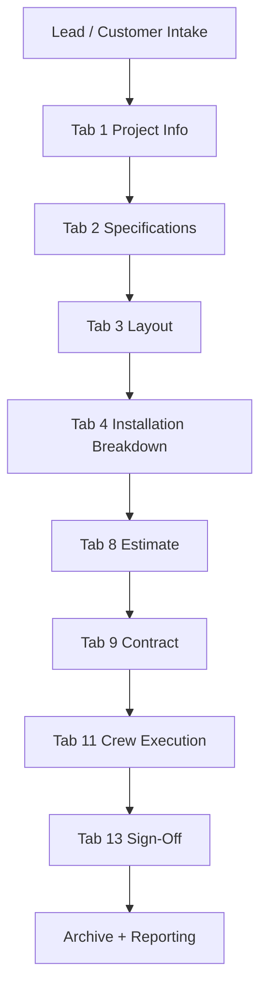

### 4.2 Money Flow
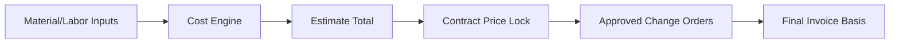

### 4.3 Information Flow
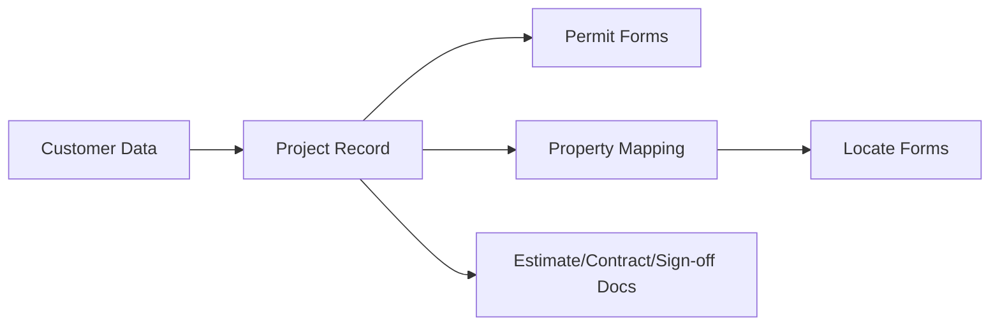

---

## SECTION 5: SYSTEM CONNECTIVITY DIAGRAM

### 5.1 Connectivity Map

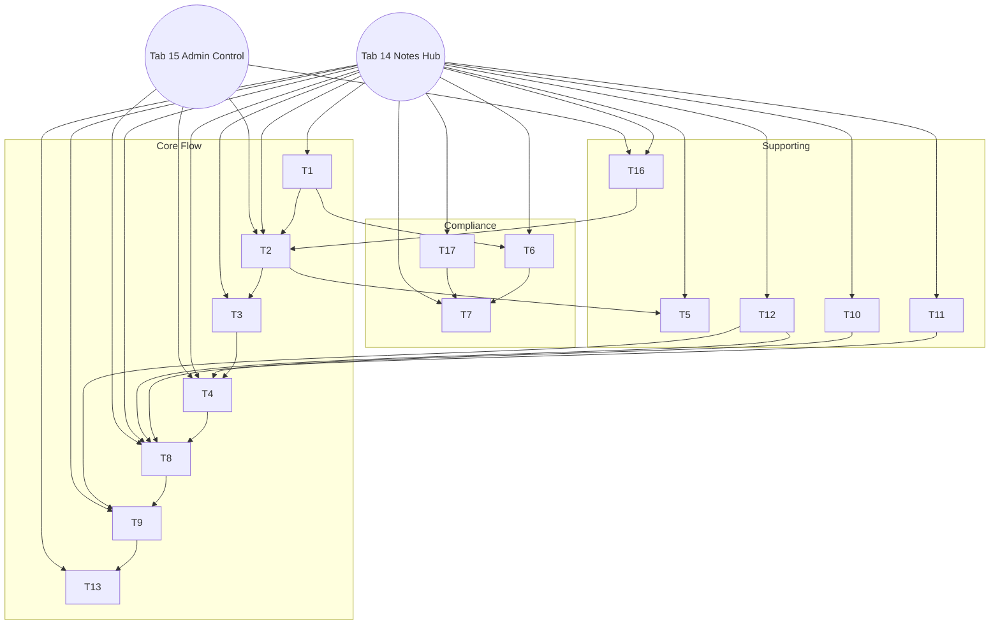

---

## SECTION 6: FEATURE SPECIFICATIONS

### 6.1 Dropdown Tutorials System
- Each tab includes contextual tutorial blocks
- Tutorials explain fields, required inputs, and downstream impacts
- Admin may update tutorial templates

### 6.2 Tutorial Toggle Checkboxes
- Per-tab **Show tutorial** toggle
- Persisted per user/session preference
- Default state configurable in admin settings

### 6.3 Gate CAD Fabrication Generator
- Inputs: opening width/height, frame type, hinge/latch placement
- Outputs: fabrication drawing, cut list, hardware list
- Exports: PDF and CAD-compatible file where configured

### 6.4 Pricing Lock Mechanism
- Contract lock visual state (`LOCKED` badge)
- Prevents edits to contract price fields post-approval
- Any pricing change requires Change Order (Tab 12)

### 6.5 Auto-Calculation Engine (Flowchart)
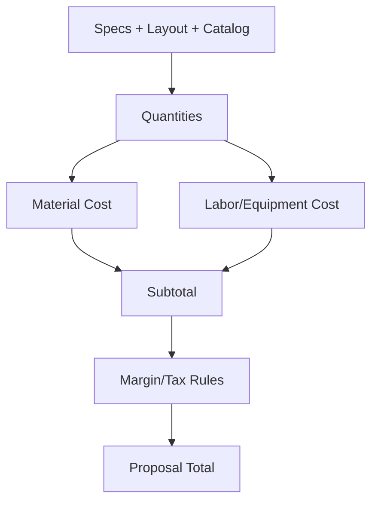

### 6.6 Document Generation System
- Trigger points: permits, locate sheets, proposal, contract, CO, sign-off
- Documents include version stamp and project ID
- PDF output standardized for print/email

### 6.7 Email/Print Capabilities
- Email send from document preview screen
- Print-ready formatting for all generated forms
- Optional CC/BCC templates maintained in admin settings

### 6.8 Integration Points Diagram
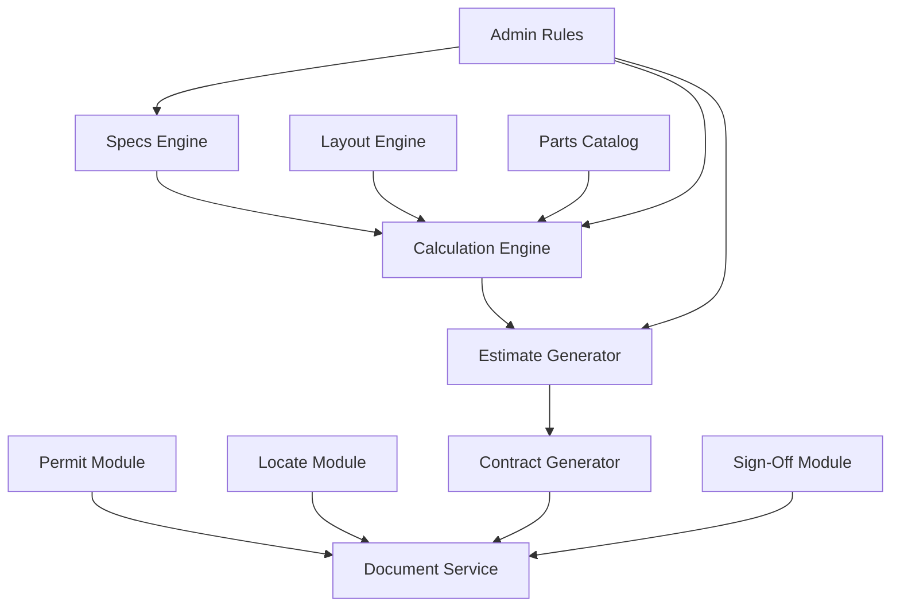

### 6.9 Document Generation Flow Diagram
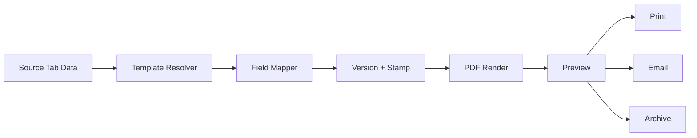

### 6.10 Admin Settings Impact Diagram
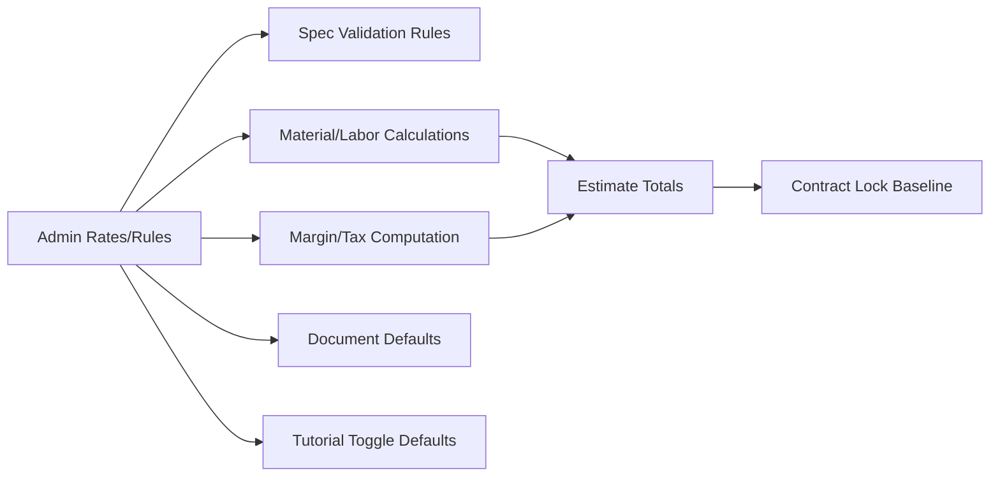

---

## SECTION 7: DATABASE OVERVIEW

### 7.1 Logical Schema Diagram

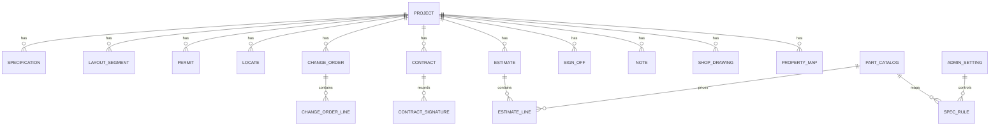

### 7.2 Key Tables / Data Points
- **PROJECT:** project_id, customer_id, site_address, status
- **SPECIFICATION:** fence type, height, gauge, color, coating
- **LAYOUT_SEGMENT:** segment type, length, gate markers
- **ESTIMATE / ESTIMATE_LINE:** qty, unit cost, markups, totals
- **CONTRACT:** locked_price, terms, signature status
- **CHANGE_ORDER:** reason, delta_cost, approval status
- **NOTE:** tags, scope, linked_tab
- **PART_CATALOG:** SKU, UOM, category, active flag
- **ADMIN_SETTING:** tax rates, labor rates, tutorial defaults

---

## SECTION 8: USER WORKFLOWS

### 8.1 New Project Creation


### 8.2 Estimate Creation


### 8.3 Contract Generation


### 8.4 Change Order Process
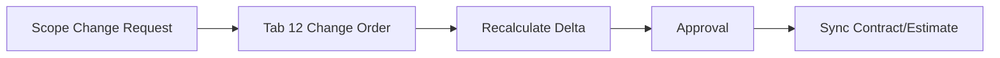

### 8.5 Project Sign-Off Workflow


---

## SECTION 9: QUALITY ASSURANCE SPECIFICATIONS

### 9.1 Test Workflow Diagram
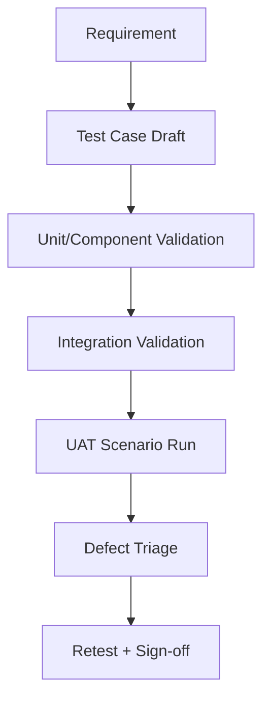

### 9.2 100+ Test Cases (110 Listed)

**Project & Customer (TC-001 to TC-015)**
1. TC-001 Create project with required fields only
2. TC-002 Create project with full customer details
3. TC-003 Validate missing customer name error
4. TC-004 Validate invalid email format
5. TC-005 Validate invalid phone format
6. TC-006 Save draft and reopen
7. TC-007 Edit project after save
8. TC-008 Duplicate project name handling
9. TC-009 Unique project ID generation
10. TC-010 Address auto-format behavior
11. TC-011 Date range validation
12. TC-012 Sales rep assignment persistence
13. TC-013 Status transition (Draft->Active)
14. TC-014 Cancel project creation
15. TC-015 Project archival flag behavior

**Specifications (TC-016 to TC-030)**
16. TC-016 Fence type dropdown loads options
17. TC-017 Height dropdown affects material rule
18. TC-018 Mesh/gauge combinations validate correctly
19. TC-019 Color options filter by fence type
20. TC-020 Gate type impacts hardware counts
21. TC-021 Post type impacts quantity calculations
22. TC-022 Rail options alter BOM
23. TC-023 Coating adds proper surcharge
24. TC-024 Region code alters compliance prompts
25. TC-025 Reset specification form
26. TC-026 Save and reload specs
27. TC-027 Invalid spec combo error messaging
28. TC-028 Tutorial toggle show/hide
29. TC-029 Tutorial preference persistence
30. TC-030 Notes pin from tab 14 appears in tab 2

**Layout & Mapping (TC-031 to TC-045)**
31. TC-031 Draw single straight segment
32. TC-032 Draw multi-segment boundary
33. TC-033 Corner insertion updates geometry
34. TC-034 Gate placement on valid segment
35. TC-035 Gate placement on invalid segment blocked
36. TC-036 Segment delete recalculates total LF
37. TC-037 Snap-to-grid behavior
38. TC-038 Overlap detection warning
39. TC-039 Property map import to layout
40. TC-040 Parcel boundary lock mode
41. TC-041 Measurement unit toggle metric/imperial
42. TC-042 Mapping export sheet generation
43. TC-043 Layout validation blocks empty design
44. TC-044 Undo/redo layout operations
45. TC-045 Large-lot rendering performance threshold

**Installation & Crew (TC-046 to TC-060)**
46. TC-046 Post count calculation from layout
47. TC-047 Mesh roll quantity rounding rule
48. TC-048 Concrete volume calculation
49. TC-049 Labor hours baseline calculation
50. TC-050 Crew size adjustment impacts duration
51. TC-051 Waste factor application
52. TC-052 Equipment day-rate application
53. TC-053 Recalculate after spec change
54. TC-054 Crew sheet print preview
55. TC-055 Crew sheet includes safety checklist
56. TC-056 Missing locate ticket warning in crew sheet
57. TC-057 Installation phase split by day
58. TC-058 Material pull list sorted by sequence
59. TC-059 Negative quantity prevention
60. TC-060 Installation totals pass to estimate

**Permits & Locates (TC-061 to TC-070)**
61. TC-061 Permit form auto-population from project
62. TC-062 Jurisdiction-specific form selection
63. TC-063 Required attachment checklist validation
64. TC-064 Permit PDF generation
65. TC-065 Locate contacts displayed by region
66. TC-066 Locate ticket expiration warning
67. TC-067 Locate sheet PDF generation
68. TC-068 Permit-to-contract linkage visibility
69. TC-069 Incomplete permit blocks contract finalization rule
70. TC-070 Notes shared between permits and locates

**Estimate, Contract, Change Orders (TC-071 to TC-095)**
71. TC-071 Proposal subtotal accuracy
72. TC-072 Margin application accuracy
73. TC-073 Tax rate application from admin settings
74. TC-074 Extras update estimate total
75. TC-075 Change order delta updates revised total
76. TC-076 Estimate PDF export formatting
77. TC-077 Contract auto-populates from estimate
78. TC-078 Contract lock activates on finalize
79. TC-079 Locked contract blocks direct price edit
80. TC-080 Change order required after lock for price change
81. TC-081 Multiple change orders cumulative total
82. TC-082 CO approval required before sync
83. TC-083 Contract signature capture customer
84. TC-084 Contract signature capture company
85. TC-085 Signature date/time stamping
86. TC-086 Proposal validity expiry handling
87. TC-087 Discount approval workflow
88. TC-088 Deposit schedule calculation
89. TC-089 Rounding consistency across totals
90. TC-090 Currency formatting consistency
91. TC-091 Estimate regeneration after layout update
92. TC-092 Contract regeneration with locked baseline preserved
93. TC-093 Version history for estimate revisions
94. TC-094 CO PDF includes before/after totals
95. TC-095 Final invoice basis equals contract + approved COs

**Admin, Catalog, Notes, Security, Performance (TC-096 to TC-110)**
96. TC-096 Admin role required for settings update
97. TC-097 Permission denial for non-admin on tab 15
98. TC-098 Catalog add SKU success path
99. TC-099 Catalog edit SKU updates dependent calculations
100. TC-100 Deactivated SKU hidden from new estimates
101. TC-101 Notes search by keyword
102. TC-102 Notes search by tag
103. TC-103 Notes cross-tab pin/unpin behavior
104. TC-104 Audit log entry for rate changes
105. TC-105 Export action audit logging
106. TC-106 Session timeout and re-auth prompt
107. TC-107 Unauthorized endpoint access blocked
108. TC-108 Concurrent edit conflict handling
109. TC-109 Large project calculation response time under threshold
110. TC-110 Multi-tab navigation stability under load

### 9.3 Edge Cases
- Zero-length or duplicate layout segments
- Contract lock with pending unsaved CO edits
- SKU deactivated after estimate draft but before contract finalization
- Missing permit for jurisdiction requiring permit
- Utility locate expired on scheduled install date

### 9.4 Performance Requirements
- Recalculation under 2 seconds for standard residential scope
- Large project refresh under 5 seconds for 500+ LF
- PDF generation under 8 seconds for typical proposal package

---

## SECTION 10: IMPLEMENTATION TIMELINE

| Week | Focus | Deliverables |
|---|---|---|
| Week 1 | Core architecture + Tabs 1-5 | Project core, specs, layout, installation, drawings |
| Week 2 | Tabs 6-11 | Permits, locates, estimate, contract, extras, crew |
| Week 3 | Tabs 12-17 + integration | Change orders, sign-off, notes, admin, catalog, mapping |
| Week 4 | QA, hardening, documentation | 100+ tests, defect closure, final docs/package |

### 10.1 Delivery Sequence
1. Architecture baseline + data model
2. Core tab implementation and inter-tab data binding
3. Document generation and pricing lock controls
4. QA sign-off and deployment package

---

## REQUIRED VISUAL ELEMENTS CHECKLIST

- [x] System Architecture Diagram (all tabs and connections)
- [x] 17 Tab Wireframes (one per tab)
- [x] Data Flow Diagrams (project, money, information)
- [x] Connectivity Map
- [x] Workflow Diagrams (user journeys)
- [x] Database Schema Diagram
- [x] Integration Points Diagram (explicit diagram in Section 6.8)
- [x] Process Flowcharts (auto-calculation + QA workflow)
- [x] Document Generation Flow (feature spec section)
- [x] Admin Settings Impact Diagram (explicit diagram in Section 6.10)

---

## FORMAT OPTIONS

This document is delivered in **Markdown** and can be exported to:
1. PDF
2. Microsoft Word
3. HTML
4. Markdown (source of truth in repository)
