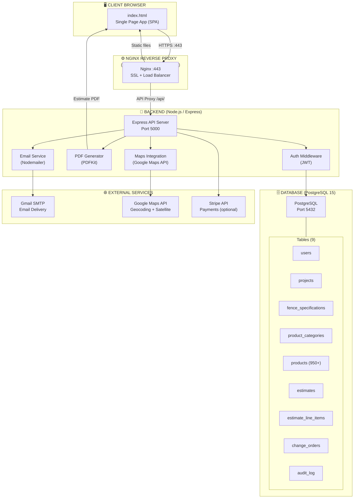
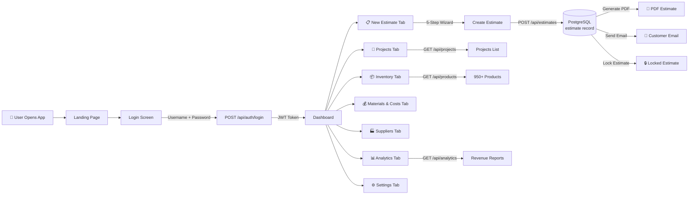
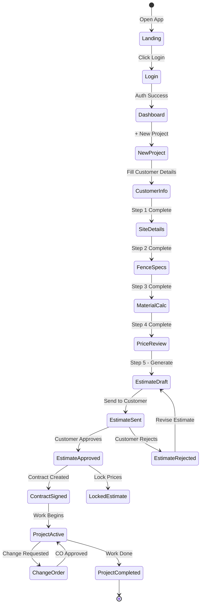
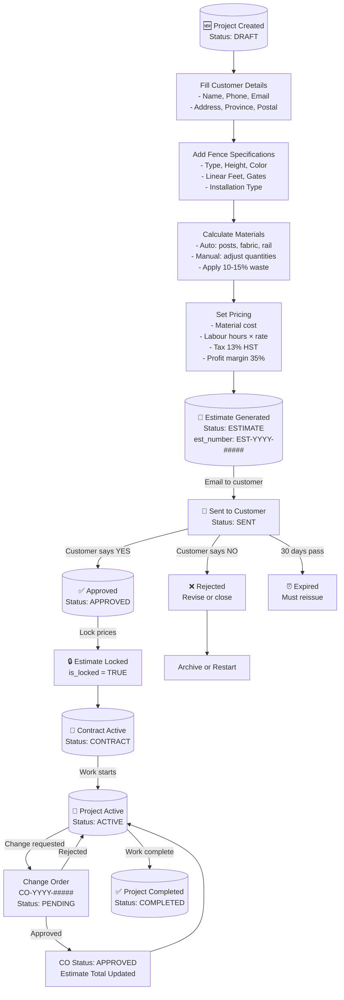
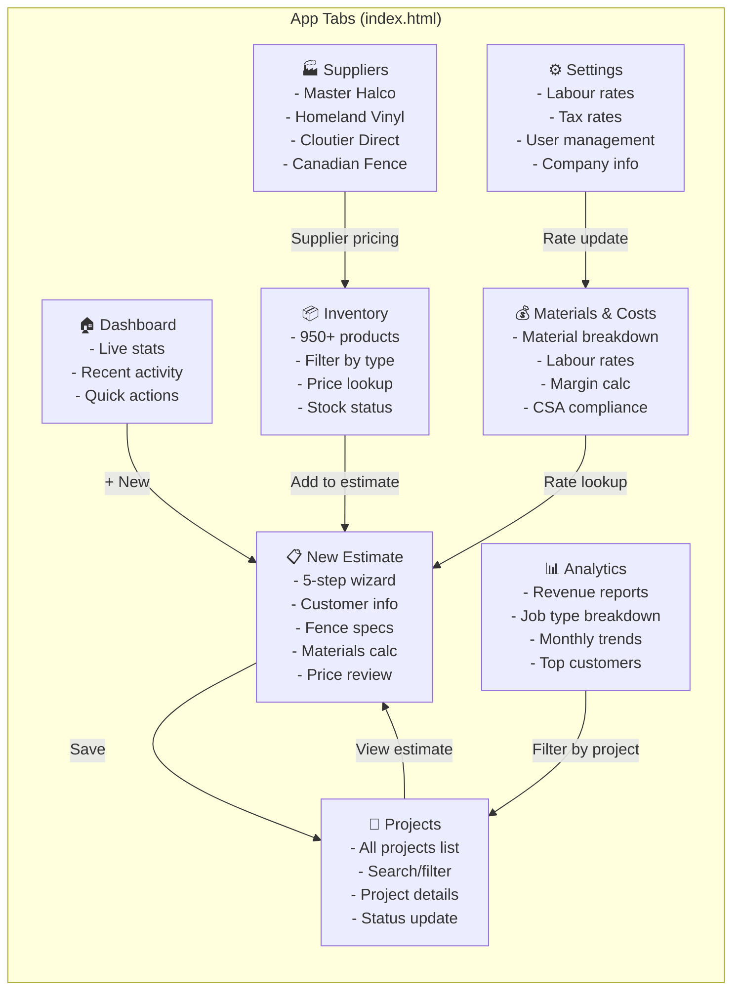
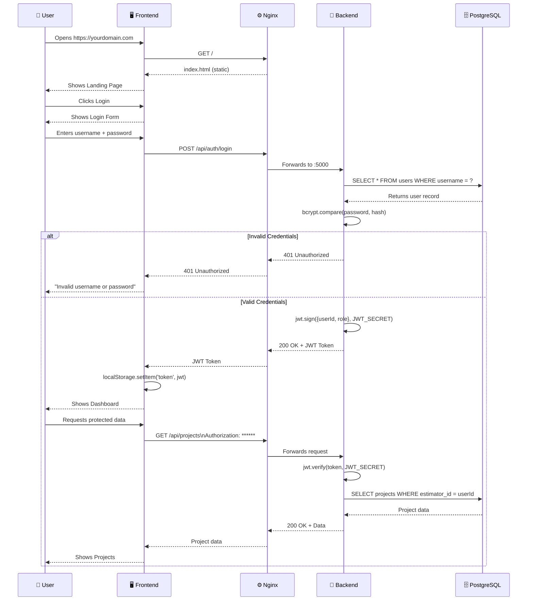
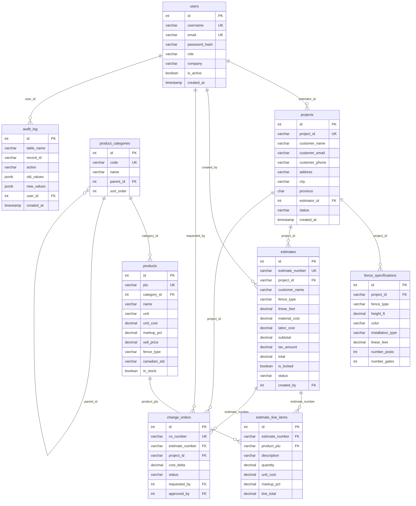
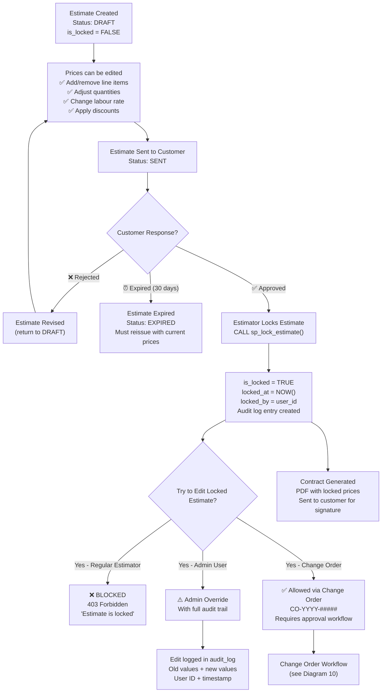
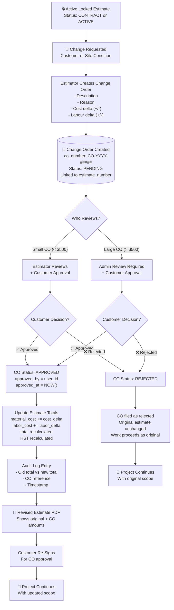

# PART 6: WIRE GRIDS — SYSTEM ARCHITECTURE & FLOW DIAGRAMS
## Fence Depot Estimator — 10 Complete Diagrams

> All diagrams use Mermaid syntax. Render with any Mermaid-compatible viewer,
> GitHub (renders natively), VS Code Mermaid Preview extension, or https://mermaid.live

---

## DIAGRAM 1 — SYSTEM ARCHITECTURE OVERVIEW



---

## DIAGRAM 2 — DATA FLOW OVERVIEW



---

## DIAGRAM 3 — USER WORKFLOW (FULL ESTIMATE LIFECYCLE)



---

## DIAGRAM 4 — PROJECT LIFECYCLE



---

## DIAGRAM 5 — TAB DEPENDENCIES & NAVIGATION



---

## DIAGRAM 6 — CALCULATION FLOW (ESTIMATE ENGINE)

```mermaid
flowchart TD
    START["🚀 User Starts Estimate Wizard"] --> S1

    subgraph S1["STEP 1: Customer Information"]
        C1["Customer Name"]
        C2["Phone + Email"]
        C3["Property Address"]
        C4["Province Selection\n(determines frost depth & tax)"]
    end

    S1 --> S2

    subgraph S2["STEP 2: Site Details"]
        SD1["Property Size\n(helps verify scope)"]
        SD2["Installation Type\nResidential / Commercial / Industrial"]
        SD3["Site Access Notes"]
        SD4["Photos Upload (optional)"]
    end

    S2 --> S3

    subgraph S3["STEP 3: Fence Specifications"]
        FS1["Fence Type\nChain Link / Vinyl / Wood\nWrought Iron / Guide Rail"]
        FS2["Height\n3ft / 4ft / 5ft / 6ft / 8ft / 10ft"]
        FS3["Color\nGalvanized / Green / Black / Brown\nWhite / Tan / Natural"]
        FS4["Linear Feet"]
        FS5["Number of Gates"]
        FS6["Barbed Wire? Y/N\n(Commercial only)"]
        FS7["Gate Type\nSwing / Sliding / Double / Cantilever"]
    end

    S3 --> S4

    subgraph S4["STEP 4: Material Calculation"]
        MC1["Auto-Calculate Posts\n÷ 10ft spacing + terminal posts"]
        MC2["Auto-Calculate Fabric\n= Linear Feet + 10% waste"]
        MC3["Auto-Calculate Rail\n= Linear Feet ÷ 21ft sections"]
        MC4["Auto-Calculate Hardware\nBands, bars, tie wire, caps"]
        MC5["Auto-Calculate Concrete\n= Total Posts × CY per post"]
        MC6["Auto-Calculate Gates\n= Gate qty × gate assembly"]
        MC7["Manual Overrides\n(estimator can adjust)"]
    end

    S4 --> S5

    subgraph S5["STEP 5: Pricing & Review"]
        P1["Material Total\n= SUM all line items"]
        P2["Labour Hours\n= Linear Feet ÷ 100 × hours/100LF"]
        P3["Labour Cost\n= Hours × Rate × Markup"]
        P4["Subtotal\n= Materials + Labour"]
        P5["Tax (HST)\n= Subtotal × 13%"]
        P6["Total\n= Subtotal + Tax"]
        P7["Profit Check\n= (Total - Cost) ÷ Total × 100%"]
    end

    S5 --> GEN["📄 Generate Estimate\nEST-YYYY-#####"]
    GEN --> LOCK["🔒 Lock Option\n(after customer approval)"]
    LOCK --> PDF["📄 Generate PDF"]
    PDF --> EMAIL["📧 Email to Customer"]
```



---

## DIAGRAM 7 — AUTHENTICATION FLOW



---

## DIAGRAM 8 — DATABASE RELATIONSHIPS (ERD)



---

## DIAGRAM 9 — PRICING LOCK FLOW



---

## DIAGRAM 10 — CHANGE ORDER FLOW



---

## 📐 DIAGRAM RENDERING INSTRUCTIONS

### Option 1: GitHub (Automatic)
GitHub renders Mermaid diagrams natively in Markdown files. View this file at:
```
https://github.com/Auction2026/fence-estimator/blob/main/docs/PART_6_WIRE_GRIDS.md
```

### Option 2: VS Code
1. Install extension: "Mermaid Preview" by Arjun Sinh Dabhoya
2. Open this file in VS Code
3. Press `Ctrl+Shift+P` → "Preview Mermaid Diagram"

### Option 3: Mermaid Live Editor (Online)
1. Go to: https://mermaid.live
2. Paste any diagram code block content (without the triple backticks)
3. View and export as PNG, SVG, or PDF

### Option 4: Export as Images
```bash
# Install mermaid-cli
npm install -g @mermaid-js/mermaid-cli

# Export all diagrams as PNG
mmdc -i docs/PART_6_WIRE_GRIDS.md -o /tmp/diagram.png
```

---

## 📊 DIAGRAM SUMMARY

| # | Diagram Name | Type | Key Information |
|---|-------------|------|-----------------|
| 1 | System Architecture | Graph TB | Full stack: Browser → Nginx → Express → PostgreSQL |
| 2 | Data Flow | Flowchart LR | User actions → API calls → Data responses |
| 3 | User Workflow | State Diagram | Estimate lifecycle states from DRAFT to COMPLETED |
| 4 | Project Lifecycle | Flowchart TD | Project from creation to completion with all statuses |
| 5 | Tab Dependencies | Graph LR | How 8 app tabs interact and share data |
| 6 | Calculation Flow | Flowchart TD | 5-step wizard material and pricing calculation engine |
| 7 | Authentication | Sequence Diagram | Login → JWT → Protected API call sequence |
| 8 | Database ERD | Entity Relationship | All 9 tables with primary keys, foreign keys, data types |
| 9 | Pricing Lock Flow | Flowchart TD | When/how estimates are locked and what can change |
| 10 | Change Order Flow | Flowchart TD | Change order creation → approval → estimate update |

---

*Fence Depot Estimator — Wire Grids & Architecture Diagrams*
*10 Complete Diagrams | Canadian Standards Compliant*
*August 2026*
