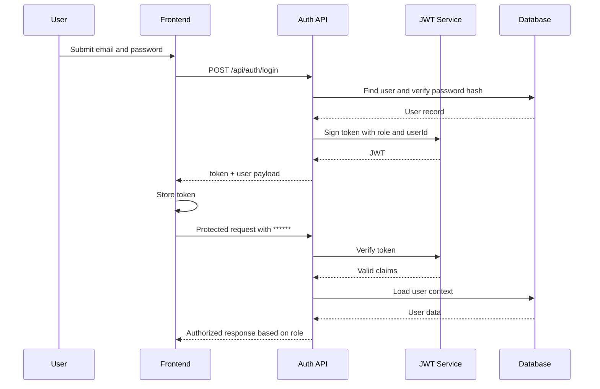

# Authentication Flow

```mermaid
sequenceDiagram
    participant U as User
    participant F as Frontend
    participant A as Auth API
    participant J as JWT Service
    participant D as Database

    U->>F: Submit email and password
    F->>A: POST /api/auth/login
    A->>D: Find user and verify password hash
    D-->>A: User record
    A->>J: Sign token with role and userId
    J-->>A: JWT
    A-->>F: token + user payload
    F->>F: Store token
    F->>A: Protected request with ******
    A->>J: Verify token
    J-->>A: Valid claims
    A->>D: Load user context
    D-->>A: User data
    A-->>F: Authorized response based on role
```
