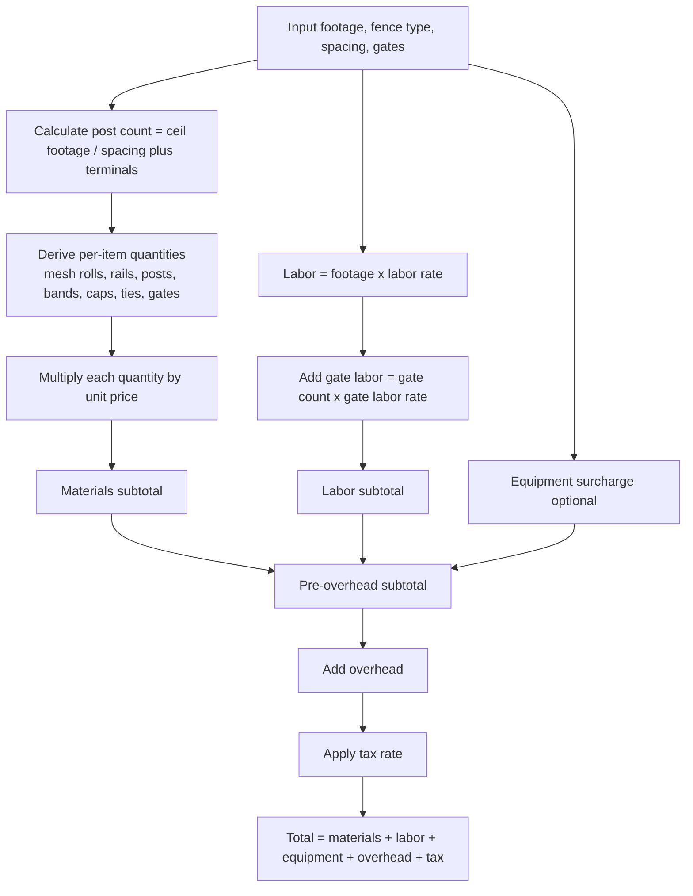

# Calculation Flow

```mermaid
flowchart TD
    A[Input footage, fence type, spacing, gates] --> B[Calculate post count = ceil footage / spacing plus terminals]
    B --> C[Derive per-item quantities\nmesh rolls, rails, posts, bands, caps, ties, gates]
    C --> D[Multiply each quantity by unit price]
    D --> E[Materials subtotal]
    A --> F[Labor = footage x labor rate]
    F --> G[Add gate labor = gate count x gate labor rate]
    G --> H[Labor subtotal]
    A --> I[Equipment surcharge optional]
    E --> J[Pre-overhead subtotal]
    H --> J
    I --> J
    J --> K[Add overhead]
    K --> L[Apply tax rate]
    L --> M[Total = materials + labor + equipment + overhead + tax]
```
