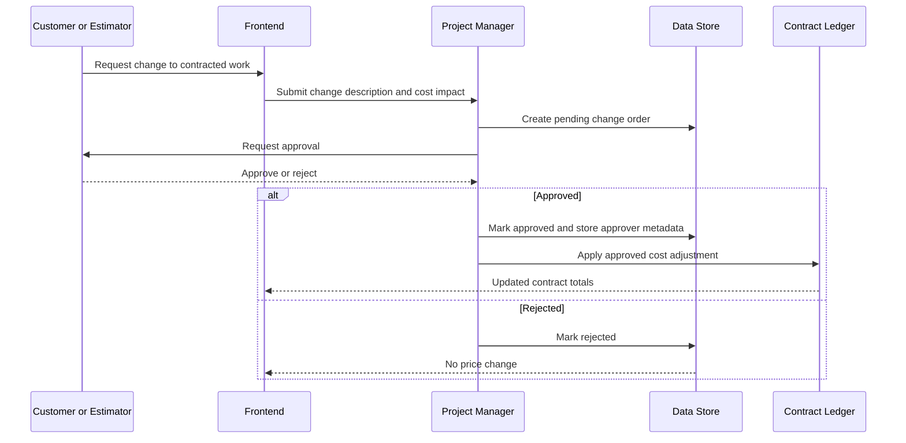

# Change Order Flow

```mermaid
sequenceDiagram
    participant C as Customer or Estimator
    participant UI as Frontend
    participant PM as Project Manager
    participant DB as Data Store
    participant CT as Contract Ledger

    C->>UI: Request change to contracted work
    UI->>PM: Submit change description and cost impact
    PM->>DB: Create pending change order
    PM->>C: Request approval
    C-->>PM: Approve or reject
    alt Approved
        PM->>DB: Mark approved and store approver metadata
        PM->>CT: Apply approved cost adjustment
        CT-->>UI: Updated contract totals
    else Rejected
        PM->>DB: Mark rejected
        DB-->>UI: No price change
    end
```
