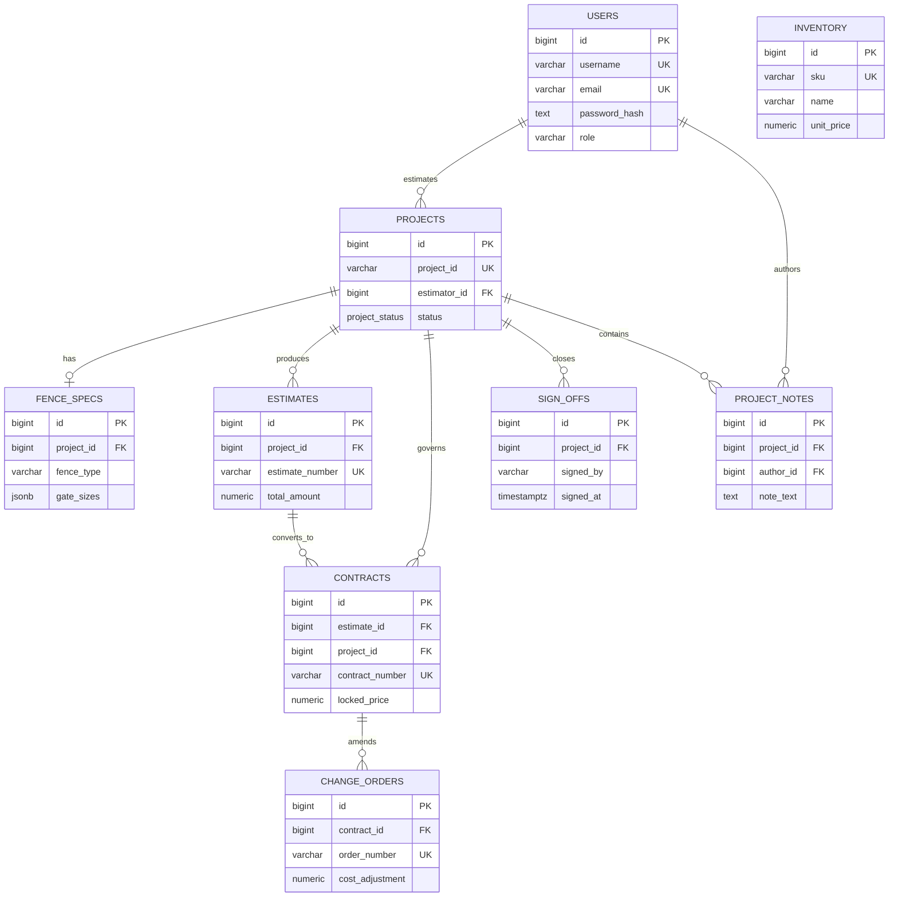

# Database Relationships

```mermaid
erDiagram
    USERS ||--o{ PROJECTS : estimates
    PROJECTS ||--o| FENCE_SPECS : has
    PROJECTS ||--o{ ESTIMATES : produces
    ESTIMATES ||--o{ CONTRACTS : converts_to
    PROJECTS ||--o{ CONTRACTS : governs
    CONTRACTS ||--o{ CHANGE_ORDERS : amends
    PROJECTS ||--o{ SIGN_OFFS : closes
    PROJECTS ||--o{ PROJECT_NOTES : contains
    USERS ||--o{ PROJECT_NOTES : authors

    USERS {
        bigint id PK
        varchar username UK
        varchar email UK
        text password_hash
        varchar role
    }
    PROJECTS {
        bigint id PK
        varchar project_id UK
        bigint estimator_id FK
        project_status status
    }
    FENCE_SPECS {
        bigint id PK
        bigint project_id FK
        varchar fence_type
        jsonb gate_sizes
    }
    ESTIMATES {
        bigint id PK
        bigint project_id FK
        varchar estimate_number UK
        numeric total_amount
    }
    CONTRACTS {
        bigint id PK
        bigint estimate_id FK
        bigint project_id FK
        varchar contract_number UK
        numeric locked_price
    }
    CHANGE_ORDERS {
        bigint id PK
        bigint contract_id FK
        varchar order_number UK
        numeric cost_adjustment
    }
    SIGN_OFFS {
        bigint id PK
        bigint project_id FK
        varchar signed_by
        timestamptz signed_at
    }
    PROJECT_NOTES {
        bigint id PK
        bigint project_id FK
        bigint author_id FK
        text note_text
    }
    INVENTORY {
        bigint id PK
        varchar sku UK
        varchar name
        numeric unit_price
    }
```
