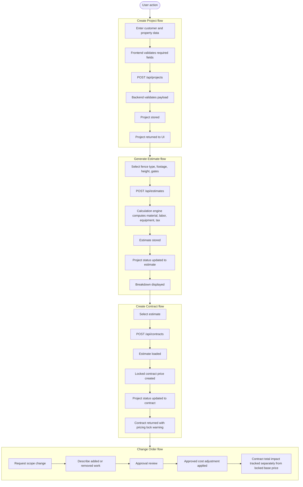

# Data Flow Diagram

```mermaid
flowchart TD
    Start([User action]) --> CreateProject

    subgraph CreateProject[Create Project flow]
        CP1[Enter customer and property data] --> CP2[Frontend validates required fields]
        CP2 --> CP3[POST /api/projects]
        CP3 --> CP4[Backend validates payload]
        CP4 --> CP5[Project stored]
        CP5 --> CP6[Project returned to UI]
    end

    CP6 --> GenerateEstimate

    subgraph GenerateEstimate[Generate Estimate flow]
        GE1[Select fence type, footage, height, gates] --> GE2[POST /api/estimates]
        GE2 --> GE3[Calculation engine computes material, labor, equipment, tax]
        GE3 --> GE4[Estimate stored]
        GE4 --> GE5[Project status updated to estimate]
        GE5 --> GE6[Breakdown displayed]
    end

    GE6 --> CreateContract

    subgraph CreateContract[Create Contract flow]
        CC1[Select estimate] --> CC2[POST /api/contracts]
        CC2 --> CC3[Estimate loaded]
        CC3 --> CC4[Locked contract price created]
        CC4 --> CC5[Project status updated to contract]
        CC5 --> CC6[Contract returned with pricing lock warning]
    end

    CC6 --> ChangeOrder

    subgraph ChangeOrder[Change Order flow]
        CO1[Request scope change] --> CO2[Describe added or removed work]
        CO2 --> CO3[Approval review]
        CO3 --> CO4[Approved cost adjustment applied]
        CO4 --> CO5[Contract total impact tracked separately from locked base price]
    end
```
