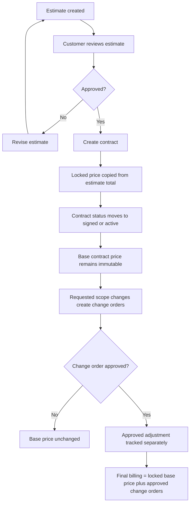

# Pricing Lock Flow

```mermaid
flowchart TD
    A[Estimate created] --> B[Customer reviews estimate]
    B --> C{Approved?}
    C -- No --> D[Revise estimate]
    D --> A
    C -- Yes --> E[Create contract]
    E --> F[Locked price copied from estimate total]
    F --> G[Contract status moves to signed or active]
    G --> H[Base contract price remains immutable]
    H --> I[Requested scope changes create change orders]
    I --> J{Change order approved?}
    J -- No --> K[Base price unchanged]
    J -- Yes --> L[Approved adjustment tracked separately]
    L --> M[Final billing = locked base price plus approved change orders]
```
