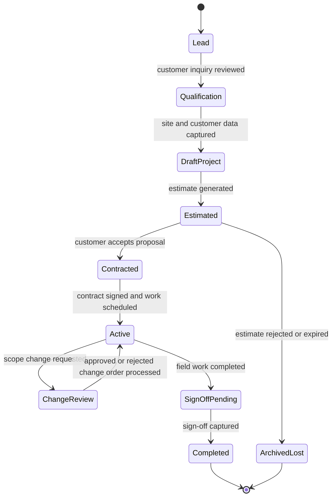

# Project Lifecycle

```mermaid
stateDiagram-v2
    [*] --> Lead
    Lead --> Qualification: customer inquiry reviewed
    Qualification --> DraftProject: site and customer data captured
    DraftProject --> Estimated: estimate generated
    Estimated --> Contracted: customer accepts proposal
    Contracted --> Active: contract signed and work scheduled
    Active --> ChangeReview: scope change requested
    ChangeReview --> Active: approved or rejected change order processed
    Active --> SignOffPending: field work completed
    SignOffPending --> Completed: sign-off captured
    Estimated --> ArchivedLost: estimate rejected or expired
    Completed --> [*]
    ArchivedLost --> [*]
```
