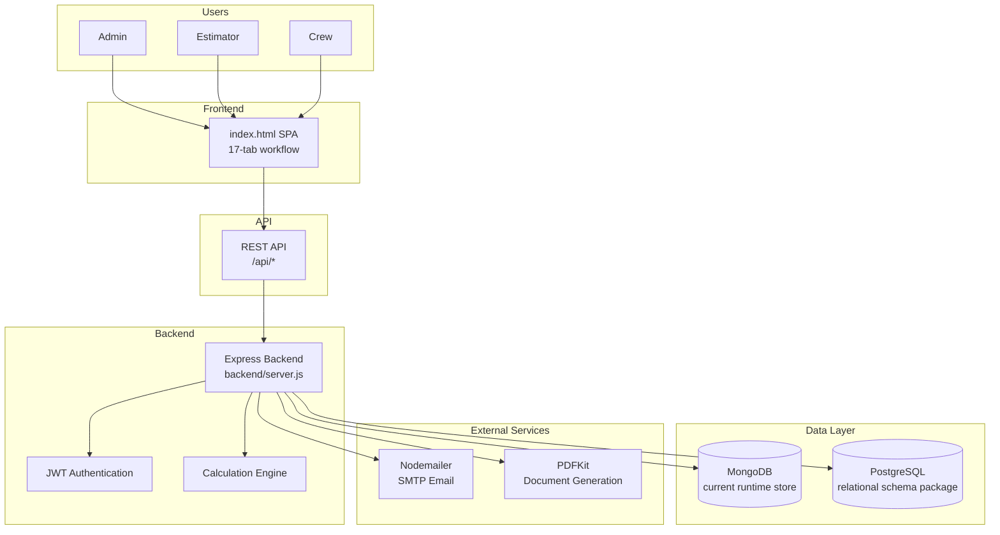

# System Architecture

```mermaid
graph TD
    subgraph Users
        A[Admin]
        E[Estimator]
        C[Crew]
    end

    subgraph Frontend
        F[index.html SPA\n17-tab workflow]
    end

    subgraph API
        R[REST API\n/api/*]
    end

    subgraph Backend
        B[Express Backend\nbackend/server.js]
        Auth[JWT Authentication]
        Calc[Calculation Engine]
    end

    subgraph Data Layer
        M[(MongoDB\ncurrent runtime store)]
        P[(PostgreSQL\nrelational schema package)]
    end

    subgraph External Services
        N[Nodemailer\nSMTP Email]
        D[PDFKit\nDocument Generation]
    end

    A --> F
    E --> F
    C --> F
    F --> R
    R --> B
    B --> Auth
    B --> Calc
    B --> M
    B --> P
    B --> N
    B --> D
```
