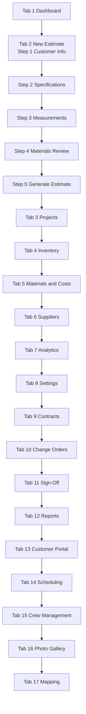

# User Workflow

```mermaid
flowchart TD
    T1[Tab 1 Dashboard] --> T2A[Tab 2 New Estimate\nStep 1 Customer Info]
    T2A --> T2B[Step 2 Specifications]
    T2B --> T2C[Step 3 Measurements]
    T2C --> T2D[Step 4 Materials Review]
    T2D --> T2E[Step 5 Generate Estimate]
    T2E --> T3[Tab 3 Projects]
    T3 --> T4[Tab 4 Inventory]
    T4 --> T5[Tab 5 Materials and Costs]
    T5 --> T6[Tab 6 Suppliers]
    T6 --> T7[Tab 7 Analytics]
    T7 --> T8[Tab 8 Settings]
    T8 --> T9[Tab 9 Contracts]
    T9 --> T10[Tab 10 Change Orders]
    T10 --> T11[Tab 11 Sign-Off]
    T11 --> T12[Tab 12 Reports]
    T12 --> T13[Tab 13 Customer Portal]
    T13 --> T14[Tab 14 Scheduling]
    T14 --> T15[Tab 15 Crew Management]
    T15 --> T16[Tab 16 Photo Gallery]
    T16 --> T17[Tab 17 Mapping]
```
